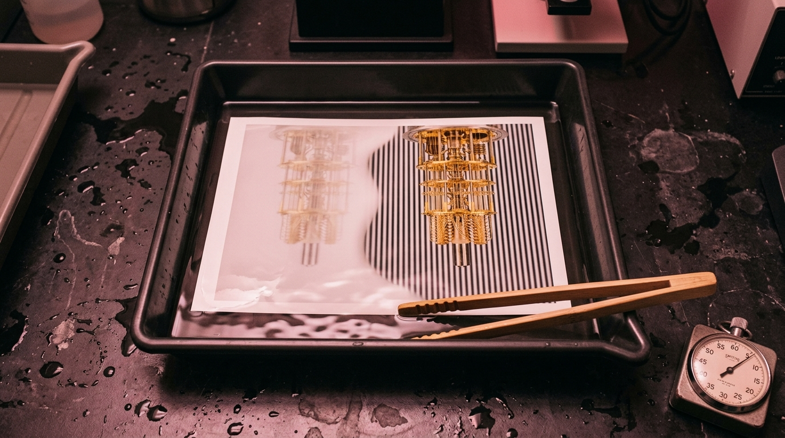
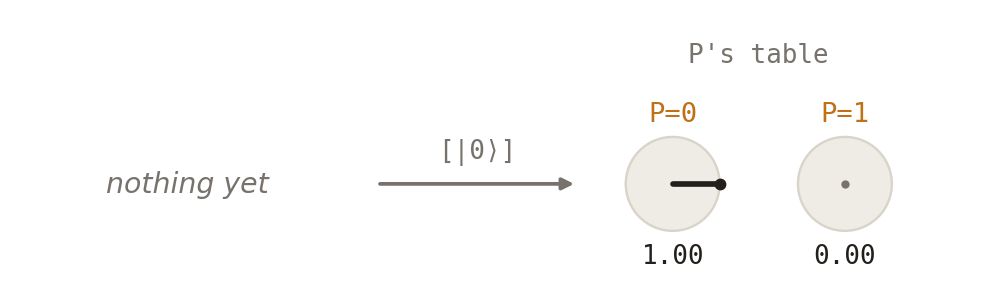
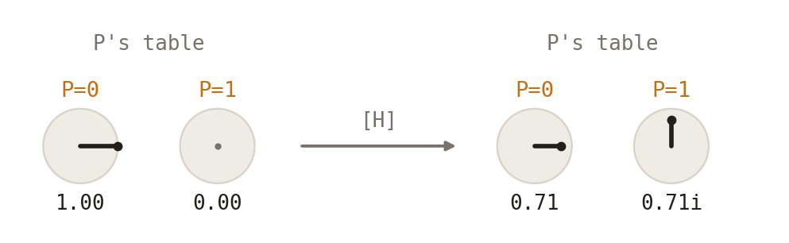
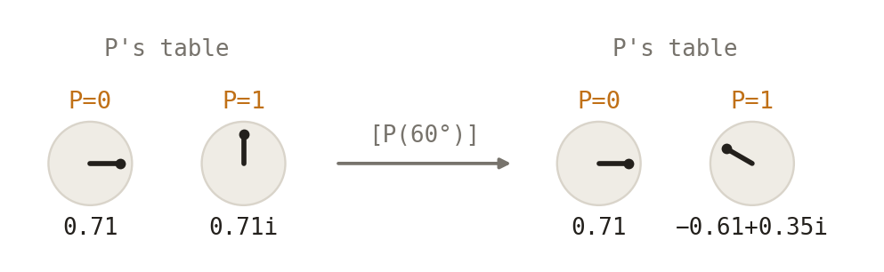
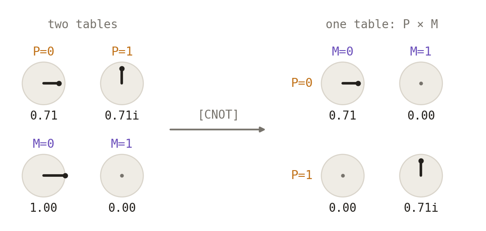
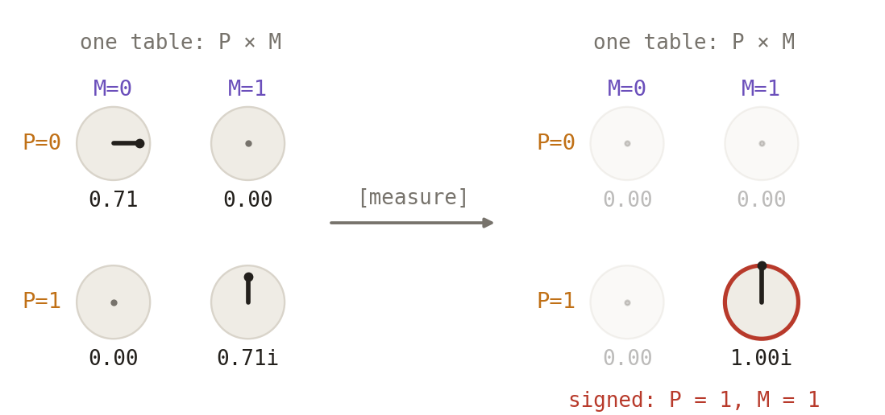
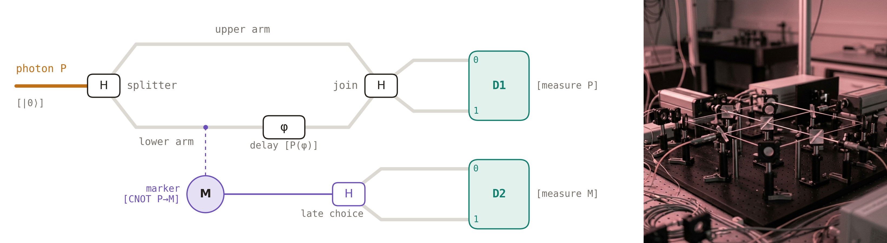
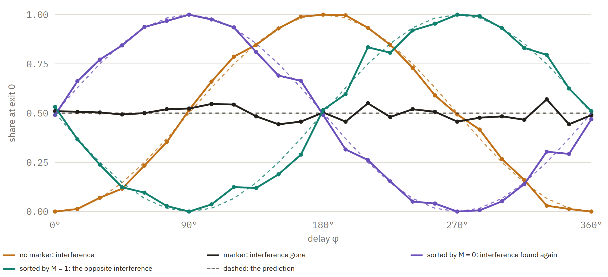
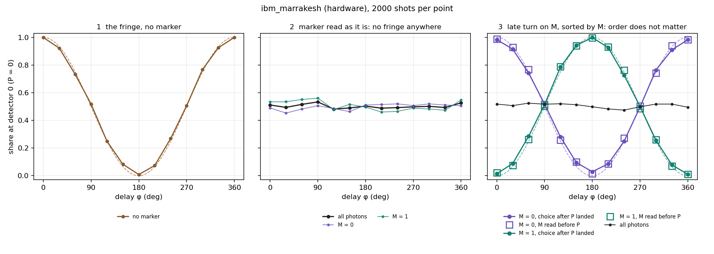

# Developed, Not Erased

*Quest for Entropy #18: we ran Wheeler's late choice on a quantum computer. The order didn't matter.*

<!-- A print half developed in the tray: the picture was in the paper all along. The developer only shows it. -->

## The question

In 1978 John Wheeler proposed a strange experiment. Send one photon into an interferometer: a beam splitter sends it into two paths, the arms, and a second splitter brings the arms back together. With the second splitter in place, the photon behaves like a wave: it goes both ways, the two ways add or cancel, and the detectors show interference. Take the second splitter out, and each detector sees one arm only. The photon behaves like a particle that went one way.

Now the twist. Decide whether the second splitter is in or out *after* the photon has already entered the arms. Did the photon "know" in advance which question it would be asked? Wheeler's experiment has since been done for real, with the choice made by a random number generator while the photon was in flight (Jacques and colleagues, 2007). The photon never gets it wrong.

The story then got stranger. In the quantum eraser (Scully and Drühl, 1982), a marker records which arm the photon took, and the fringes vanish. "Erase" the marker's record, and the fringes come back. In the delayed-choice quantum eraser (Kim and colleagues, 1999), the erasing choice is made after the photon has already hit the screen. This is where the popular version says it: a choice made today decides what a photon did yesterday. The future edits the past.

I want to say from the start that there is no mystery to sell in this episode. Physicists already know that the future does not edit the past here. What I wanted was to *see* why, step by step, on the toy from last episode.

It reminds me of a card trick. Arrange a deck red, black, red, black. Let a friend deal about half of it into a pile and riffle the two halves together. Deal the cards out, and red and black look randomly mixed. Now take them two at a time: every pair is one red and one black. The shuffle did not destroy the order. It hid it in the pairs, and you can choose to look at pairs long after the shuffle. The deck never needed to know. The math is Norman Gilbreath's, from 1958, and almost nobody works it out in their head while watching. The delayed choice works much the same way, with one twist no card trick can copy. We will get to it.

Last episode, [Two to Sign Is the Norm](https://questforentropy.com/p/two-to-sign-is-the-norm), built the ledger: a **meeting** writes nothing, it only ties tables together into a promise; a **settlement** is a fact signed in two books. This episode takes the same toy into a bigger setup, with a marker and two detectors, and walks through it step by step. Then we run the same setup on a real quantum computer. I had never done that before. This was my first time, and as a software architect, sending a job to a machine that computes with interference was very exciting.

## The toy

### A quantum computer, from the outside

To me a quantum computer is a form of native computation. A traditional digital computer simulates nature. It is itself built on nature's processes, electrical signals switching transistors, but it forces them into 0s and 1s and then does the arithmetic on top, step by step. A quantum computer skips the simulation. Nature runs its own process, and we only read the result.

As a software architect, I think of it as a script running through an interpreter versus machine code. The interpreter imitates every step, so it runs slower. For arrows, the slowdown is brutal: every extra qubit doubles the numbers a normal computer has to keep. Fifty qubits need more numbers than any laptop can hold. For the real machine, that is just fifty qubits. Richard Feynman said it first, in 1981: if you want to simulate quantum nature, you had better make the computer quantum.

The idea of letting physics compute is older. Stretch a soap film between pins on two glass plates, and the film settles into a short network connecting the pins, solving a route problem by physics. But native does not mean better at everything. Soap films get stuck in good-but-not-best answers, as Scott Aaronson found when he tried it (2005). A quantum computer is the same. It wins only on problems shaped like its own physics. For adding up our bills, the laptop wins.

A quantum computer is, in essence, an interferometer you can program. Each qubit carries two arrows. Operations turn and mix the arrows, and a measurement reads out one answer. Useful quantum algorithms arrange the arrows so that the wrong answers cancel and the right ones add.

This episode needs five operations. Each is shown on the tables from last episode: every cell holds an arrow, and the length of the arrow is what a settlement will read. The table before the operation is on the left, the table after it on the right. The quantum-computer name is in brackets.

#### The start

**[|0⟩]** A particle's table has two cells, 0 and 1, and in general both hold an arrow. Physicists write that as *a*|0⟩ + *b*|1⟩: arrow *a* in cell 0, arrow *b* in cell 1, and the squares of their lengths add to 1. So a particle can start in many ways. |0⟩ is the simplest one: all the length in cell 0, nothing in cell 1. A quantum computer starts every qubit like this, and any other start is made from it by turns. In this episode every particle starts as |0⟩: the photon P, the marker M, and the two detector particles D1 and D2.

#### The turn

**[H, a beam splitter]** A turn moves length from one cell to the other. It can turn by any angle, just as a real beam splitter can let through any share of the light: 50/50, 90/10, whatever the glass is made for. A small angle moves a little; 90° moves everything across, like a mirror. On a quantum computer the general turn is a rotation gate (RX). This episode uses only 45°, the halfway turn, where both cells end up with 0.71, whose squares add to 1. That is the 50/50 splitter, and quantum computers have a standard gate for it, H. The length that crosses arrives turned by a quarter circle, which is why the toy writes it as 0.71i. (H handles that quarter circle a little differently. It is only a convention, see the Confession.)

The same turn can split and it can join. With all the length in one cell, it splits: the photon now takes both arms. When both cells already hold arrows, each cell after the turn gets a share from both, and the two shares add like arrows. If they point the same way they grow, and if they point opposite ways they cancel. That is the join, and that is where interference happens. Which exit lights up depends on the angle between the two arrows, and the delay sets that angle.

#### The delay

**[P(φ), a path difference]** The delay turns the arrow in cell 1 by an angle φ, here 60°. It never moves length between cells, so on its own it changes nothing a settlement can read. It only matters later, at the join. On an optical table it is a slightly longer path; on the bench it is the φ dial.

#### The meeting

**[CNOT, controlled NOT]** Two particles meet, and their two tables become one table of four cells. The quantum-computer name says what happens: P is the control, M is the target. Where P is in cell 0, M is left alone. Where P is in cell 1, M's cells swap. M started as |0⟩, so M ends up copying P: the P=0 line goes with M=0, the P=1 line with M=1. Nothing is written. It is a promise, and from now on neither table can be read alone.

#### The measurement

**[measure, a detector]** A detector reads the particles. In our terminology this is a *settlement*: two books sign one line, and the rest goes. The odds of a line are its length squared, here 0.71² = one half for each of the two lines. In this picture the line P=1, M=1 was signed. In the setup below, the readings are done by the detector particles D1 and D2. That is #17 in one picture.

### The setup

For simplicity, this episode uses the qubit version of the experiment, not a screen. The famous double slit has a whole screen of fringes. The qubit has two detectors and a dial for the path difference. Turning the dial from 0° to 360° is like walking along the screen through one bright and one dark band. The qubit leaves out the screen's wide envelope, but it keeps the interference, and it runs on a quantum computer exactly as drawn. Even this small version is hard enough to hold in your head.

<!-- left: the setup with each element's operation in brackets. right: an optical table (a generated illustration, not our lab) -->

A photon P meets the splitter and takes both arms. A marker M touches the lower arm on the way: that is a meeting, M copies which arm. The lower arm carries the delay φ. The join brings the arms back together, and a detector particle D1 reads which output the photon took. Much later, M gets its own turn, the late choice, and a second detector particle D2 reads M.

### What happens, in plain words

The full run, one action at a time, lives on [the bench](https://questforentropy.com/p/developed-not-erased/bench), where you can turn every dial yourself. Here is the same story without the machinery.

**One photon, two arms.** The splitter sends the photon into both arms. It is still one photon with one table: one cell for the upper arm, one cell for the lower arm. Each cell holds an arrow. The arrows are not odds. The odds come only at the very end, as an arrow's length squared. That is the whole secret of this episode: two odds can only add up, but two arrows can also cancel.

**The join.** The join brings the arms back together, and each detector gets a piece of both arrows. When the two arms are equal, the pieces cancel at one detector and add up at the other, so every photon goes to the same detector. Now make the lower arm a little longer. That is the delay. Its arrow turns, the pieces no longer cancel exactly, and some photons start arriving at the other detector. Turn the delay half a circle and all the photons have switched detectors. That swing, as you turn the dial, is the fringe: the qubit's version of the bright and dark bands on a screen.

**The marker.** Now let a second particle, the marker M, touch the lower arm. That is a meeting, not a reading. Nothing is signed, and nobody knows which arm. But the photon and the marker now share one table, and the table has two columns, one for each value of M. The upper arm's arrow sits in column 0. The lower arm's arrow sits in column 1. Both arrows are still there, with the same length. They are only in different columns, and arrows can add or cancel only when they share a cell. These two never meet, so nothing cancels. Each detector gets half the photons, whatever the delay. The fringe is gone.

It looks as if the marker forced the photon to pick an arm. It didn't. Nothing was read, and both arrows are still in the table. They were only moved to where they cannot meet.

**The late choice.** Long after the photon has landed, we give M a halfway turn, and only then read it. The turn mixes M's two columns, so each column again holds a piece of both arms. Inside each column the arrows meet, so each column has its own fringe. But where one column's arrows add, the other's cancel: the two fringes are opposites. Now sort the photons by M's answer. Each group shows a full fringe. Put the two groups back together, and the opposite fringes add up to the same flat line we already had.

If we read M without the turn, M just names the arm, and the sorted groups show no fringe. That is the whole choice. Either way, every photon landed where it landed, and the pile as a whole is flat. The choice decides only how the pile can be sorted afterwards.

<!-- brown: interference, no marker. black: marker, interference gone. purple and green: the same photons sorted by M, interference found again, two opposite halves. dashed: the prediction -->

Brown is the fringe with no marker. Black is the marker present, all photons: flat at one half. Purple and green are *the same photons*, sorted afterwards by M's answer. Each is a full fringe, and together they average back to the flat black line.

So the trick is not in the timing. Nothing has to travel back and tell the photon what we will do later. The trick is in the table underneath: it holds arrows, and arrows can cancel. The marker hides the fringe by moving the arrows apart. The late turn does not bring the fringe back into the pile. It only lets us find it inside the pile, split into two opposite halves that were there all along. The fringe was never erased. It was developed.

Remember the card trick. The shuffle is the marker, and taking the cards in pairs is sorting by M. Here is the twist: each pair of cards is there whether you look or not. The photon's groups are not. They depend on how we read M. Read it straight, without the turn, and the groups show no interference at all. That part is the arrows, and no card trick can copy it.

And if all this is right, doing the late choice early should change nothing. That is what we asked the quantum computer.

## The run

Then the quantum computer. We ran four circuits on ibm_marrakesh, one of IBM's 156-qubit Heron machines, on the free plan. Qubit 0 is the photon, qubit 1 is the marker, and measuring a qubit plays the detector particle settling. There were 13 delays per circuit and 2,000 shots per point, and the whole job used about 29 seconds of machine time.

1. **No marker**: the fringe.
2. **The marker read as it is**: no fringe anywhere.
3. **Late**: the photon lands first, then the marker gets its turn and is read.
4. **Early**: the marker gets its turn and is read *before the photon even reaches the join*.

Late and early are the same gates in the opposite order. If a late choice sent a message to the past, the two would have to differ.

<!-- panel 3: filled dots = choice after the photon landed; open squares = marker read before the photon reached the join -->

They don't. The fringe without the marker runs from 1.000 down to 0.009 and back to 1.000, very close to the ideal. With the marker read as it is, every group stays near 0.5. And in the third panel the dots and the squares sit on top of each other: the largest gap between late and early is 0.037, and the spread is exactly what chance alone gives (χ² of 28.3 on 26 points). The machine cannot tell which came first.

I will admit it: watching real hardware land on the dashed lines, on my first job ever, was a special moment.

## The Confession

Every episode confesses. This one has four items.

**Nothing here is a mystery to physics.** Every count on the bench and on the machine is the one quantum mechanics predicts, and delayed-choice experiments have been done and tested many times. Physicists have long known that the late choice sends no message to the past. What the toy adds is a picture in which every step is one station, and the only step that is more than table arithmetic is the settlement.

**The toy's splitter and the computer's H differ only by a convention**: a quarter turn where H has a sign flip, so the bench and the machine call a different exit 0.

**The qubit is not the screen.** The qubit keeps the interference and drops the screen's envelope. That is what makes it runnable on a quantum computer, and it is also what it leaves out.

**The toy is told where the settlements happen.** D1 and D2 settle because the setup says so. Why a detector particle settles and a marker only makes a promise is still open. That question, the difference between a meeting and a settlement, is the next episode's.

## What this does NOT claim

> This episode shows that on the ledger toy from #17 the delayed-choice quantum eraser runs as a strict sequence of meetings and two settlements, with no step that waits and no message to the past, and that a real quantum computer gives the same sorted fringes whether the marker is turned and read before the photon reaches the join or after it has landed. It does **not** derive the arrows: the turns, the delay and the meetings are standard quantum arithmetic, imported. It does not say why a detector settles and a marker does not. It is not the first delayed-choice circuit run on a cloud quantum computer; it is ours, with the code public so that you can break it.

## The neighbors

Wheeler proposed the delayed choice in 1978, and Jacques and colleagues realized it with single photons in 2007. The quantum eraser is Scully and Drühl's, 1982; the delayed-choice eraser that launched the popular "future edits the past" story is Kim, Yu, Kulik, Shih and Scully, published in 2000. The trade-off between how visible the fringe is and how well the arm is known was made exact by Englert in 1996; the bench's partial late dial draws that trade-off. Ma, Kofler and Zeilinger's 2016 review surveys the whole family of delayed-choice experiments. The plainest explanation I know of why the eraser erases nothing is Sean Carroll's 2019 post on "the notorious delayed-choice quantum eraser"; this episode says the same thing with the toy. And delayed-choice circuits have been run on cloud quantum computers by others before us.

## Run it yourself

The whole run, one action at a time, with every dial: [the bench](https://questforentropy.com/p/developed-not-erased/bench). The arrow picture of where the fringe goes: [Fringe Arrows](https://questforentropy.com/p/developed-not-erased/fringe-arrows). The quantum-computer run, one script, the simulator by default and IBM hardware with your own free account: [github.com/masteris777/quest-for-entropy-developed-not-erased](https://github.com/masteris777/quest-for-entropy-developed-not-erased), one command: `python order_test_qiskit.py`. The raw counts from our hardware run are in the repository, so you can check our numbers without a quantum computer.

Archived: DOI (to follow).

## How this was made

I'm a software architect. I built an adversarial research harness around AI agents and ran a physics toy-model programme through it; this piece reports a part that survived. The direction, the concepts, the questions and the accept/reject calls are mine; AI systems (Anthropic's Claude Fable, Opus) executed the experiments and wrote the text, this article included, from my guidance and under my editing. Every number is code-generated and reproducible from the repository above, and the hardware counts are saved as they came back from the machine. A public honesty ledger records every commissioning error the process caught.

## Next time

So far the particles have interacted in two ways: a meeting and a settlement. A marker meets; a detector settles. How are they really different? That is the next episode.

---

*Quest for Entropy is written by Marijus Masteika. Entropy was always the dark horse for me — connected to information, and maybe hiding answers to everything. That's the quest.*
